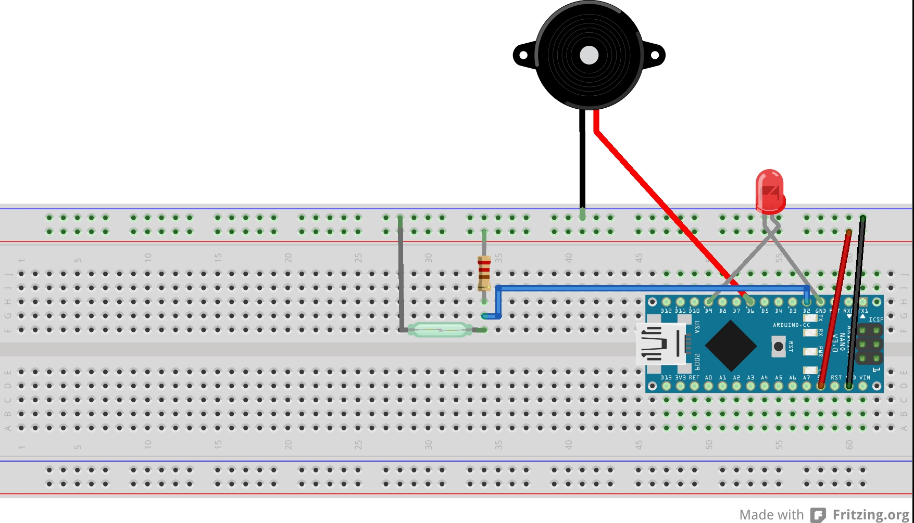
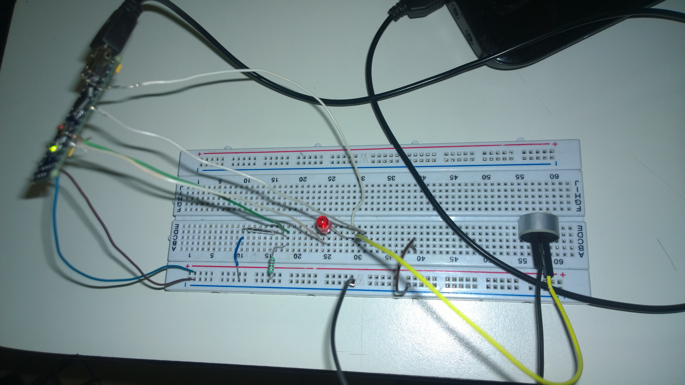
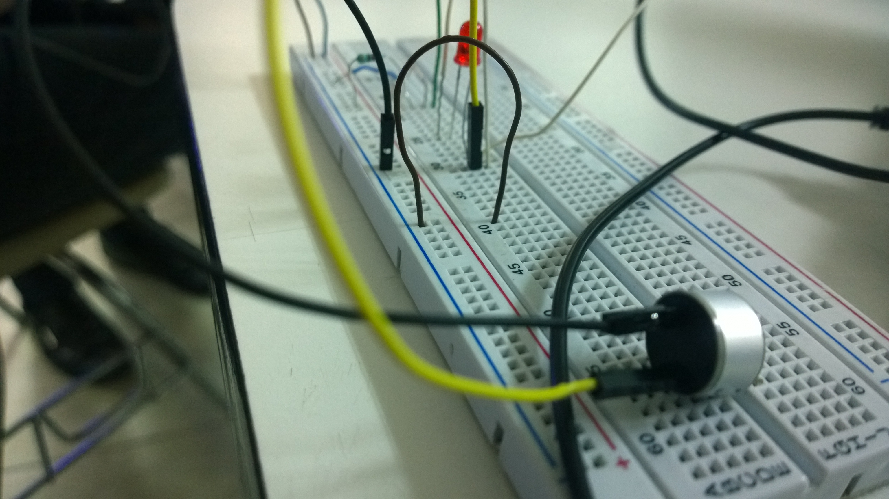
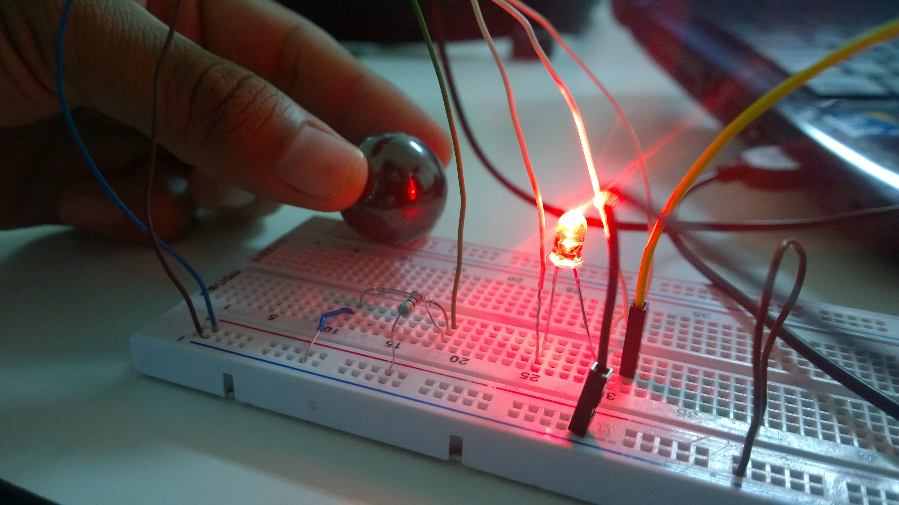
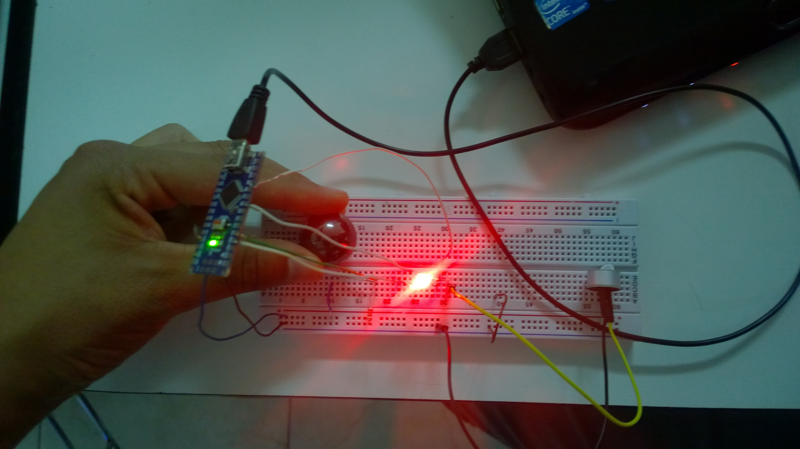

# AlarmaPuerta
Practica de arduino alarma para puerta con movimiento

Introduccion:

Con esta práctica ilustraremos cómo debe estructurar un programa en Arduino, también veremos cómo son las sentencias básicas usadas con esta IDE, cómo cargar nuestro programa a la placa y para finalizar, realizaremos un ejemplo con el que encenderemos leds con Arduino montando nuestro propia alara con sumbador y un led parpadeando, mediante hacercamos un iman, se activa el reed switch .

